# Image Segmentation in Medical Radiology: A State of the Art Review

**Author:** Gusev Roman¹  
**Affiliation:** ¹Sigmoid, Machine Learning Engineer Intern, Chișinău, Republic of Moldova  
**Email:** [gusev.roman.work@gmail.com](mailto:gusev.roman.work@gmail.com)  
**Date:** 08.09.2025


<style>
figure {
    text-align: center;
    margin: 1em auto;
    max-width: 60%;
}
</style>
# Abstract

With modern day technologies and advancements, Radiology became more
sophisticated in technological aspect - MRIs, Rontgen and CTs evolved
significantly and output images generated by them, has grown in number
and resolution. Radiologists work, that deal with them on a daily basis,
requires manual thorough analysis of each of them, becoming
time-consuming and, overall, a routine work. Image Segmentation can help
with identification of anomalies in human body in radiologic images by
segmentation using ML/DL models, and reduce the time required to process
images. This paper reviews the state-of-the-art of Machine Learning and
Radiology, focusing the attention on proposed solutions that involves
advanced Deep Learning models, such as Convolutional Neural Networks
and, less sophisticated Distance-based models, for example, K-Means
Clustering, for the task of Image Segmentation.

***Keywords*:** Radiologic Imaging, Machine Learning, Deep Learning,
Convolutional Neural Network, U-Net, Image Segmentation, Computer-Aided
Detection

# INTRODUCTION

Radiology, since its discovery in 1895 by Wilhelm Conrad Röntgen, that
noticed how X-Rays can pass through various materials, had a long and,
at the same time, fast-paced technological advancement. First radiologic
imaging were performed in 1896, in order to investigate patients organs,
marking the birth of Radiology in Medicine [[1]](#ref_intro_2). This rapid enhancement
was a result of the harmful effects caused by Röntgen radiation in
medical scannings, such as: increasing cases of leukemia in patients
that underwent ionizing radiation procedures, severe dermatitis, eye
damage and so on, that caused people to delve deeper into the radiation
study and find way to make radiologic imaging safer both for patients
and doctors [[2]](#ref_intro_2). Throughout the evolution of radiologic imaging, it
became safer than it was back then, but, besides that, it also became
more advanced thanks to technological development, were found other
solutions for medical imaging, such as Computer Tomography (CT),
Magnetic Resonance Imaging (MRI), led to higher resolution radiologic
images, as well as higher number of images done during the procedure
[[3]](#ref_intro_3). This caused an increasing load on radiologists, making them prone
to errors in interpretation. For example, in a study at a tertiary care
center, $`\approx 18.4\%`$ of the total lungs radiologic images
performed had diagnostic errors [[4]](#ref_intro_4). A modern solution to assisting
radiologists in their field is implementing Machine Learning algorithms,
that involves computer-aided assistance in interpretation of radiologic
images, using Image Segmentation techniques, which can greatly reduce
routine work, shift current "algorithmic" approach to a personalized
patient care and increase the accuracy in conclusions [[5]](#ref_intro_5). This paper
reviews the state-of-the-art of Machine Learning and Radiology, focusing
the attention on proposed solutions that involves advanced Deep Learning
models, such as Convolutional Neural Networks and, less sophisticated
Distance-based models, for example, K-Means Clustering, for the task of
Image Segmentation.

# RESEARCH METHODOLOGY

The aim of this paper is to delve into how Machine Learning algorithms
can impact medical field, specifically Radiology, and analyze existing
studies about bridging Convolutional Neural Network models and
Radiologic Imaging. For this research paper, were retrieved studies
published from academic search engines, including "PubMed",
"Researchgate", "RSNA", "Arxiv", "Medium" and "ScienceDirect", that
included information about examples of implementations of Image
Segmentation in imaging, as well as the state of art of these fields,
separately and together.

Besides analysis of existing research papers, were analyzed existing
implementations that has shown promising results in testing environment.
"GitHub" hosts several Jupyter Notebooks that show processes of
processing existing datasets, preparing them to feed to CNN models, as
well as training and testing those models on cleaned data. Thus, an
example of implementation was tried to produce in the frames of this
paper, as well as showing the results in the future sections.

# LITERATURE REVIEW

Machine Learning, as it was mentioned in the introduction, is a field of
Artificial Intelligence that involves using computational power in order
to produce output predictions by learning from input data using various
algorithms without being explicitly programmed. In other words, ML is
linked to the development of models, training them on datasets and
making predictions based on the learned patterns during the training
process. This subfield can be divided into two types:

1.  **Supervised Machine Learning**: involves machines using labeled
    data (input data contains the actual true values for each training
    sample), that, after training, predicts outcomes for unseen data
    [[6]](#ref_intro_6). This field is subsequently divided into other two categories:

    1.  *Classification*: a problem becomes a classification task when
        the output variable is a discrete, finite, or, in other words,
        categorical one. An example of a classification problem can
        serve the prediction of the presence of brain tumor. In this
        case, the output of the model is either $`0`$ (absence) or $`1`$
        (presence), which becomes a binary classification problem. For
        example, Logistic Regression, involves fitting the Sigmoid
        Function to the input data, producing a binary output, Random
        Forest Classifier, that ensembles multiple Decision Tree
        Classifiers, are all examples of classification models.

    2.  *Regression*: a problem becomes a regression task when the
        output variable is a continuous one, that is in an infinite
        range of possible values, but not mandatory bounded by any
        values. An example of a regression problem is the prediction of
        the age based on physiological input data. In this case, age can
        be taken from a range of values, that do not represent
        categories. For example, Linear Regression, which is one of the
        first models introduced in this field, involves fitting a line
        to the input data, by adjusting weights and bias of the line
        equation to the input data, Random Forest Regressor, that
        ensembles, similar as in classification case, multiple Decision
        Tree Regressors, are examples of regression models.

2.  **Unsupervised Machine Learning**: involves machines using unlabeled
    data (input data does not contain actual true values for each
    training sample), that discover various patterns and information in
    the data without intervention (supervision) [[7]](#ref_intro_7). This can also be
    divided in several types:

    1.  *Clustering*: a process of grouping unlabeled input data into
        clusters based on their similarities, used to identify different
        relationships between data points without prior knowledge about
        data itself. For example, K-Means is a Clustering algorithm that
        computes the centroids in the input data and assigns adjacent
        points to the nearest centroid.

    2.  *Dimensionality Reduction*: a process of reducing the number of
        features in the input data while retaining as much information
        as possible. Principal Component Analysis is an example of a
        Dimensionality Reduction algorithm, that captures the most
        important features in the dataset using eigenvectors and
        eigenvalues.

As time passed, Deep Learning emerged as a subset of Machine Learning
with the development of Multilayered Artificial Neural Networks, that
simulates the decision-making ability of the human brain. Compared to
classical ML models, such as the ones mentioned above, ANNs are similar
to them, but consists of multiple levels of algorithms, called layers,
which makes them multilayered [[8]](#ref_intro_8).

Artificial Neural Networks are formed of several components [[9]](#ref_intro_9):

1.  **Artificial Neuron**: a basic unit of a neural network, that
    receives several inputs, either directly from input data or from
    other neurons, processes them through a set of weights and an
    activation function, and computes an output either to output or
    other neurons (See fig.
    <a href="#fig:lit_rev_fig_1" data-reference-type="ref"
    data-reference="fig:lit_rev_fig_1">1</a>) [[10]](#ref_intro_10).

    <figure id="fig:lit_rev_fig_1" style="text-align: center;">
        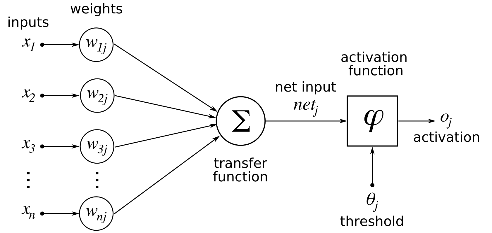
        <figcaption>Fig. 1 - Artificial Neuron Structure</figcaption>
    </figure>

2.  **Activation Function**: a mathematical function applied to the
    output of an Artificial Neuron, which introduces non-linearity into
    the model and helps it learn complex patterns in the dataset.

3.  **Input Layer**: the first layer in an ANN, responsible for
    receiving raw input data, corresponds to the features in the input
    data and passes it to the next layers (Hidden Layers).

4.  **Hidden Layers**: layers between Input and Output Layers in an ANN,
    responsible that perform most of the computations required by the
    network, using activation functions in order to create
    non-linearity. It can vary in number of layers, neurons per each
    level and connections between neurons.

5.  **Output Layer**: the last layer in an ANN, that is responsible for
    producing the output of the model. This layer contains $`n = K`$
    neurons, where
    $`K \in \{class_1, class_2, ..., class_i\}, i = num_{classes}`$ is
    the number of classes, in case of classification problem, or
    $`K=1`$ - if it used for a regression task.

<figure id="fig:lit_rev_fig_2">
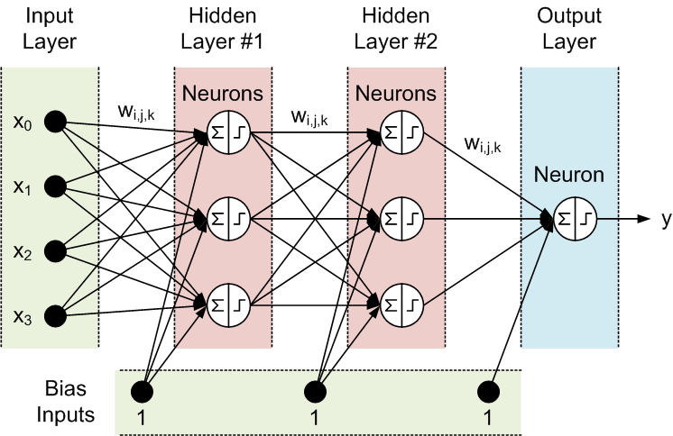
<figcaption>Fig. 2 - Artificial Neural Network Structure - Layers</figcaption>
</figure>

Work with Radiologic Imaging involves visual analysis of the images,
detection of the deviations from normality and, at the end,
interpretation and conclusions. Computers do not have eyes that can
perceive images and perform visual analysis. Since images and videos can
serve as valuable information and necessity of processing and analysis
of above-mentioned media types, a subfield of AI - Computer Vision, has
evolved largely in the last decades. Computer Vision is concerned with
finding algorithms and ways that enable computers to interpret and
analyze visual information from digital images and videos, similar to
human sight [[11]](#ref_intro_11). Computer Vision is separated into several tasks
[[12]](#ref_intro_12):

1.  **Image Classification**: the task of predicting the label/class of
    the given image, either binary or multiclass. An example of this is
    predicting presence of liver metastases in the radiologic image (See
    fig. <a href="#fig:lit_rev_fig_3" data-reference-type="ref"
    data-reference="fig:lit_rev_fig_3">3</a>).

    <figure id="fig:lit_rev_fig_3">
    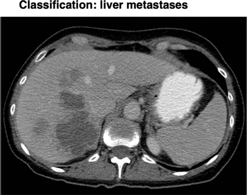
    <figcaption>Fig. 3 - Image Classification Task</figcaption>
    </figure>

2.  **Object Detection**: the task of identification and localization of
    examples of a specific class on an image. Typically for this
    problem, algorithms specifies the location and spatial extension of
    the objects that are detected in the given image by plotting a
    bounding box around the object. For example, in the same image of
    liver metastases may be noticed boxes around several metastases in
    the liver, as well as other classes in the image, such as: aorta,
    stomach and other organs (See fig.
    <a href="#fig:lit_rev_fig_4" data-reference-type="ref"
    data-reference="fig:lit_rev_fig_4">4</a>).

    <figure id="fig:lit_rev_fig_4">
    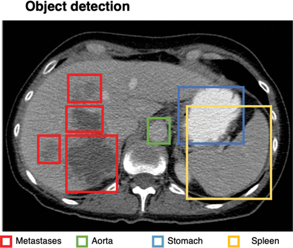
    <figcaption>Fig. 4 - Object Detection Task</figcaption>
    </figure>

3.  **Semantic Segmentation**: the task of assigning to each pixel of
    the given image a specific label/class, that results in binary masks
    (for each possible target variable), where $`0`$ shows that
    $`pixel_i \notin class_j`$, where $`class_j`$ is the class that is
    being the target for the binary mask, and $`1`$ characterizes
    $`pixel_i \in class_j`$, meaning that specific $`pixel_i`$ is
    assigned $`class_j`$. In the previous image, after semantic
    segmentation, every liver metastasis is colored red, without
    specifics about instances (See fig.
    <a href="#fig:lit_rev_fig_5" data-reference-type="ref"
    data-reference="fig:lit_rev_fig_5">5</a>).

    <figure id="fig:lit_rev_fig_5">
    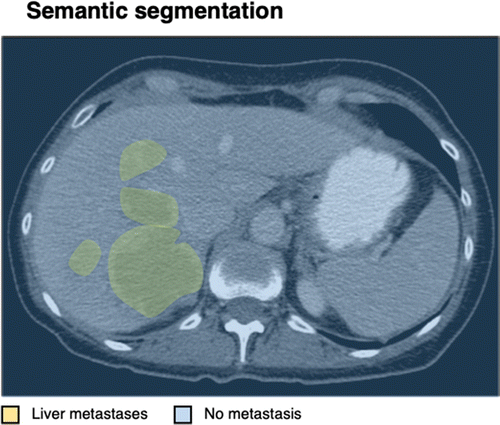
    <figcaption>Fig. 5 - Semantic Segmentation Task</figcaption>
    </figure>

4.  **Instance Segmentation**: the task similar to Semantic
    Segmentation, but focused on delineation of the objects within the
    same class instance-wise. In this case, each liver metastasis is
    colored differently, marking each object of the class of metastases
    (See fig. <a href="#fig:lit_rev_fig_6" data-reference-type="ref"
    data-reference="fig:lit_rev_fig_6">6</a>).

    <figure id="fig:lit_rev_fig_6">
    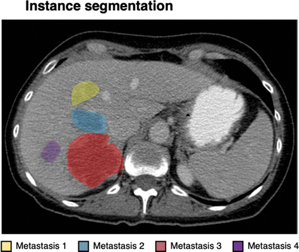
    <figcaption>Fig. 6 - Instance Segmentation Task</figcaption>
    </figure>

As a result, radiologists may benefit a lot from Computer Vision in
general [[13]](#ref_intro_13). The main focus of this paper is Image Segmentation, that has
the potency to specifically and accurately predict the position, shape
and size of the abnormalities in the images [[14]](#ref_intro_14). Depending on the
point of interest of the radiologists, they may be interested in general
interpretation, which can be done using Semantic Segmentation, or, in
case of particularities and separate instances of the analyzed class -
using Instance Segmentation.

For the task of Image Analysis, the most appropriate type of ANNs is
Convolutional Neural Network. This type of ANN was first introduced in
the 1960s. Due to its promising performance results in Computer Vision,
it quickly became one of the most commonly used ANNs in this field
[[15]](#ref_intro_15) [[16]](#ref_intro_16). CNNs are formed of 4 layers:

1.  **Convolutional Layer**: a layer that uses a kernel filter that
    slides across the input image step by step and, called convolution
    operation, calculates the dot product between the weights of the
    filter and pixel values of the image at each step and produces a new
    matrix, called 2D activation map. This operation can be expressed as
    it follows in Eq. <a href="#eq:activation" data-reference-type="ref"
    data-reference="eq:activation">[eq:activation]</a> (See fig.
    <a href="#fig:lit_rev_fig_7" data-reference-type="ref"
    data-reference="fig:lit_rev_fig_7">7</a>):
    ``` math
    Activation\text{ }map = Input * Filter = \sum_{y=0}^{columns}\left( \sum_{x=0}^{rows} Input\left(x-p, y-q\right) Filter\left(x,y\right) \right)
    ```

    <figure id="fig:lit_rev_fig_7">
    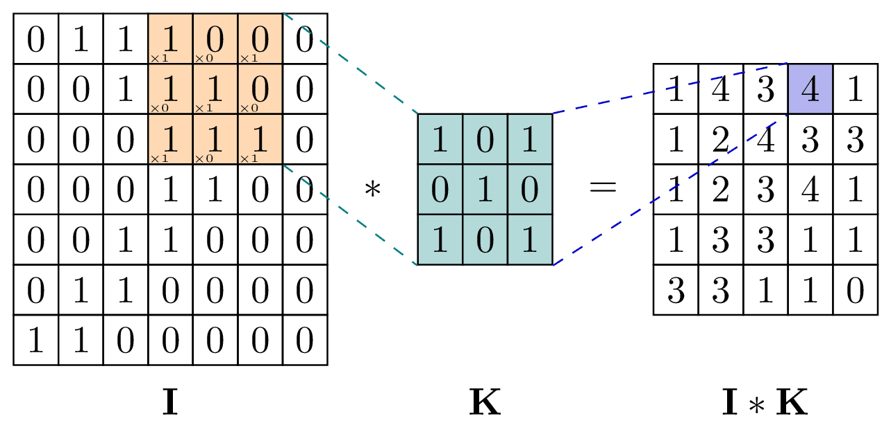
    <figcaption>Fig. 7 - Convolution Operation</figcaption>
    </figure>

2.  **Pooling Layer**: a layer that reduces the spatial dimensions
    (down-sampling) of the feature maps while retaining the most
    significant and valuable information, by the same mechanism of
    sliding a filter across the input map. One of the most common types
    of pooling layer is Max-Pooling layer, that selects highest value
    pixel and retains it (See fig.
    <a href="#fig:lit_rev_fig_8" data-reference-type="ref"
    data-reference="fig:lit_rev_fig_8">8</a>).

    <figure id="fig:lit_rev_fig_8">
    
    <figcaption>Fig. 8 - Max-Pooling Layer</figcaption>
    </figure>

3.  **Activation Function Layer**: each convolutional layer employs an
    activation function that is applied to the output map, derived after
    convolution, in order to add non-linearity for complex patterns and
    ensure consistency in pixel values. One of the most popular
    activation functions is ReLU (Rectified Linear Unit Function) as in
    Eq. <a href="#eq:relu" data-reference-type="ref"
    data-reference="eq:relu">[eq:relu]</a>, however other functions,
    such as: Sigmoid Function, can also be used.
    ``` math
    f(x) = \begin{cases}
            x, & \text{for } x > 0\\
            0, & \text{for } x\leq 0
            \end{cases}
    ```

4.  **Fully-Connected Layer**: a layer that receives, after last pooling
    or convolutional layer, the output of the maps, that is is
    flattened, and that acts as input features. This layer is
    responsible for the final prediction.

Classical CNN architecture solves the problem of Image Classification,
but Image Segmentation takes a step further, by employing inside of CNN
an Encoder and Decoder, transforming it into a Fully Convolutional
Neural Network. The following structure is based on the original
research paper by Shelhamer et. al. (See fig.
<a href="#fig:lit_rev_fig_9" data-reference-type="ref"
data-reference="fig:lit_rev_fig_9">9</a>).

<figure id="fig:lit_rev_fig_9">
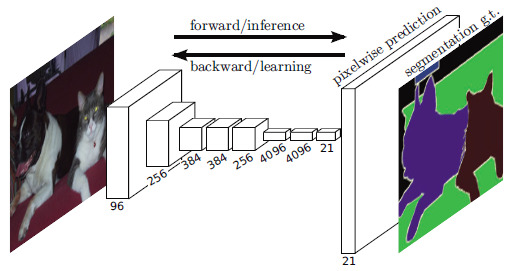
<figcaption>Fig. 9 - Fully Convolutional Neural Network Structure</figcaption>
</figure>

1.  **Encoder**: a part responsible for down-sampling, similar as in
    description above, using sequences of Convolutional and Pooling
    layers. Basically, this is the exactly above-mentioned CNN
    structure, but without the fully-connected layer

2.  **Decoder**: a single layer that is responsible for up-sampling the
    output from the Encoder in order to restore the original size of the
    image and reconstruct spatial details that may have been lost during
    the down-sampling process. This is done by transposed convolution
    operations (See fig.
    <a href="#fig:lit_rev_fig_10" data-reference-type="ref"
    data-reference="fig:lit_rev_fig_10">10</a>).

    <figure id="fig:lit_rev_fig_10">
    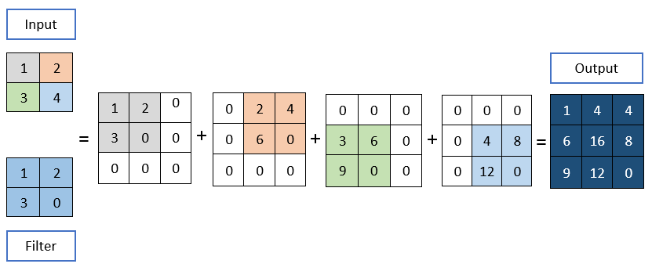
    <figcaption>Fig. 10 - Transposed Convolution Operation</figcaption>
    </figure>

One of the most used Image Segmentation models that was researched for
the task of Semantic Segmentation in Medical Imaging is U-Net, due to
its accuracy in segmentation of small targets, scalable architecture and
requirement of high computational efficiency algorithms, backed up by
the necessity of making fast decisions in critical situations, common in
medical and healthcare institutions [[18]](#ref_intro_18).

U-Net is a Fully Convolutional Neural Network, but instead of using a
single up-sampling layer in Decoder, it implements multiple steps of
up-sampling. This increases the resolution of the output image. At the
same time, U-Net adds so-called skip connections, that are derived from
the concept of ResNet (Residual Networks) (See fig.
<a href="#fig:lit_rev_fig_11" data-reference-type="ref"
data-reference="fig:lit_rev_fig_11">11</a>). These connections are
shortcuts from earlier steps in Encoder to Decoder corresponding step.
This ensures that small details of the output feature maps at each step,
that may be lost during down-sampling, are kept across the algorithm. In
other words, these connections pass context to upper layers in Encoder
[[19]](#ref_intro_19).

<figure id="fig:lit_rev_fig_11">

<figcaption>Fig. 11 - U-Net Architecture</figcaption>
</figure>

All these additions makes U-Net better at reconstruction of the original
image spatial characteristics, as well as overlapping binary maps onto
the image, creating the segments around predicted as positive class
pixels (See fig. <a href="#fig:lit_rev_fig_12" data-reference-type="ref"
data-reference="fig:lit_rev_fig_12">12</a>).

<figure id="fig:lit_rev_fig_12">
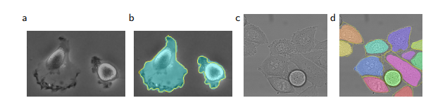
<figcaption>Fig. 12 - Example of Image Segmentation using U-Net - Result on the
ISBI cell tracking challenge. <strong>(a)</strong> part of an input
image of the "PhC-US373" data set. <strong>(b)</strong> Segmentation
result (cyan mask) with manual ground truth (yellow border)
<strong>(c)</strong> input image of the "DIC-HeLa" data set.
<strong>(d)</strong> Segmentation result (random colored masks) with
manual ground truth (yellow border).</figcaption>
</figure>

Medical Images contain many structures, both normal, such as organs,
bones, muscles, fat and others, and abnormal ones - tumors, lesions,
absence, duplication or changes in normal structures, etc. Segmentation,
in this context, covers the process of identification of both types of
structures in radiologic images. Since human body is not the same for
all people, some differences in particularities of their anatomical
characteristics, radiologic images can differ from one patient to
another, especially in abnormalities of the human body [[20]](#ref_intro_20). This
increases the complexity in training Image Segmentation models.

U-Net, due to its approach at preserving context across the steps of the
algorithm, its authors, in their original paper, mentioned its
efficiency in medical image segmentation applications. Further will be
described a study case of U-Net Image Segmentation of tumors in brain
radiologic images. Some papers cover the problem of data acquisition,
since medical images comes in various formats, for example, "Digital
Imaging and Communications in Medicine" (*DICOM*) and "Neuroimaging
Informatics Technology Initiative" (*NIFTI*), that represent
3-dimensional data, that can be thought as stacked sliced 2-dimensional
images in all 3 plans - Axial, Coronal and Sagittal (See fig.
<a href="#fig:lit_rev_fig_13" data-reference-type="ref"
data-reference="fig:lit_rev_fig_13">13</a>) [[21]](#ref_intro_21).

<figure id="fig:lit_rev_fig_13">
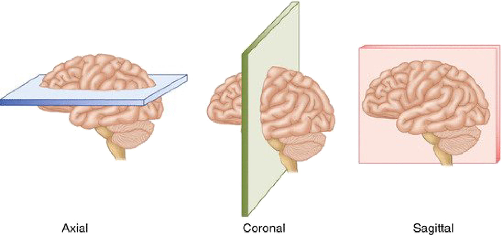
<figcaption>Fig. 13 - The three perspective planes used in medical imaging -
Axial/Transversal, Coronal and Sagittal</figcaption>
</figure>

Several datasets are available on web, including the one used in the
study case of Brain Tumor Segmentation using enhanced versions of U-Net
with EfficientNet-B4 Encoder, pretrained on ImageNet resources, which
means that the only part of the network that requires training, is
Decoder. This reduces training time and enables features extraction
using pretrained weights, resulting in higher accuracy in extracting
hierarchical features, such as edges, shapes, patterns and so on. The
proposed workflow of the model is displayed below (See fig.
<a href="#fig:lit_rev_fig_14" data-reference-type="ref"
data-reference="fig:lit_rev_fig_14">14</a>):

<figure id="fig:lit_rev_fig_14">
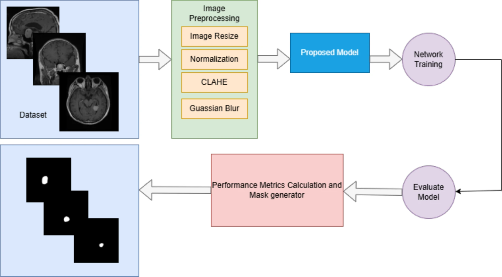
<figcaption>Fig. 14 - The three perspective planes used in medical imaging -
Axial/Transversal, Coronal and Sagittal</figcaption>
</figure>

First step of the workflow focuses on the image preprocessing. ImageNet
brain tumor dataset, used in the referenced paper, is available on
ImageNet and contains 3064 T1-weighted contrast-enhanced images from 233
patients with three kinds of brain tumor: meningioma, glioma and
pituitary tumor, alongside with true label of each sample, and tumor
border in format of a vector storing the coordinates of tumor border in
the format $`\left[x_1, y_1, x_2, y_2, ..., x_i, y_i\right]`$. All the
data is stored in `.mat` file. As addition to the dataset, original
authors provided a snippet to convert images to `.jpg` image format.
With additional implementation of extracting binary mask, that
represents ground truth segmentation, the code looks as it follows:

``` matlab
input_folder = 'your input path';
output_folder = 'your output path';
file_list = dir(fullfile(input_folder, '*.mat')); 
disp(file_list);
for i = 1:numel(file_list)
    file_name = file_list(i).name;
    file_path = fullfile(input_folder, file_name);
    
    mat_data = load(file_path);  
    cjdata = mat_data.cjdata;

    im1 = double(cjdata.image);
    min1 = min(im1(:));
    max1 = max(im1(:));
    im = uint8(255/(max1-min1)*(im1-min1));

    im1_mask = double(cjdata.tumorMask);
    min1_mask = min(im1_mask(:));
    max1_mask = max(im1_mask(:));
    im_mask = uint8(255/(max1_mask-min1_mask)*(im1_mask-min1_mask));

    label = cjdata.label;  

    tumorBorder = cjdata.tumorBorder;

    disp(tumorBorder);
    
    label_folder = fullfile(output_folder, num2str(label));
    if ~exist(label_folder, 'dir')
        mkdir(label_folder); 
    end
    
    [~, file_name_base, ~] = fileparts(file_name);
    output_file_path = fullfile(label_folder, strcat(file_name_base, '.jpg'));
    output_file_path_mask = fullfile(label_folder, strcat(file_name_base, '_mask', '.jpg'));
    
    imwrite(im, output_file_path);
    imwrite(im_mask, output_file_path_mask);
end
```

As a result, an example of input images is provided below (See fig.
<a href="#fig:lit_rev_fig_15" data-reference-type="ref"
data-reference="fig:lit_rev_fig_15">15</a>). On the left side, can be
seen the original image of the brain and on the right side the
corresponding binary mask that represents the surrounded brain tumor
border with white color.

<figure id="fig:lit_rev_fig_15" style="text-align: center;">
    <div style="display: flex; justify-content: center; gap: 20px; align-items: flex-start;">
        <div style="flex: 1;">
            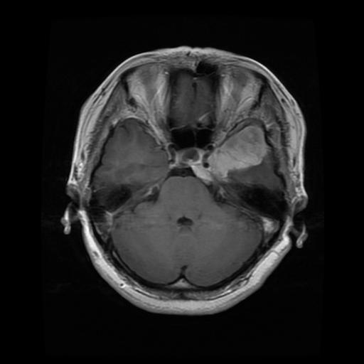
            <p><em>(a) Example of an MRI Image with brain tumor present</em></p>
        </div>
        <div style="flex: 1;">
            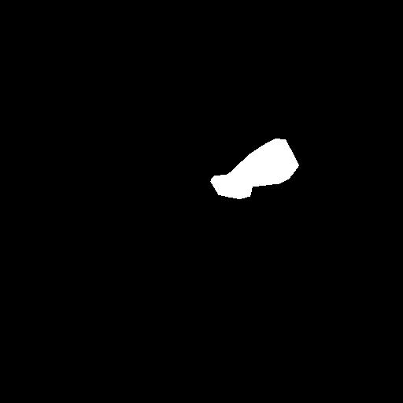
            <p><em>(b) Corresponding Binary Mask with segmented brain tumor</em></p>
        </div>
    </div>
    <figcaption>Fig. 15 - First Sample of the Brain Tumor Dataset</figcaption>
</figure>

However, images are converted to *RGB* color map, which, taken in
consideration the importance of image preprocessing, can be an obstacle
in this process. One of the outlined preprocessing steps is CLAHE
(Contrast Limited Adaptive Histogram Equalization), which is is used to
improve the contrast of images, but, instead of changing the contrast of
the entire image, it divides images in smaller parts and adjusts their
contrast separately, avoiding getting the image too bright or too dark
[[22]](#ref_intro_22). An example of advantage of this approach can be seen in the
following example (See fig.
<a href="#fig:lit_rev_fig_16" data-reference-type="ref"
data-reference="fig:lit_rev_fig_16">16</a>):

<figure id="fig:lit_rev_fig_16">
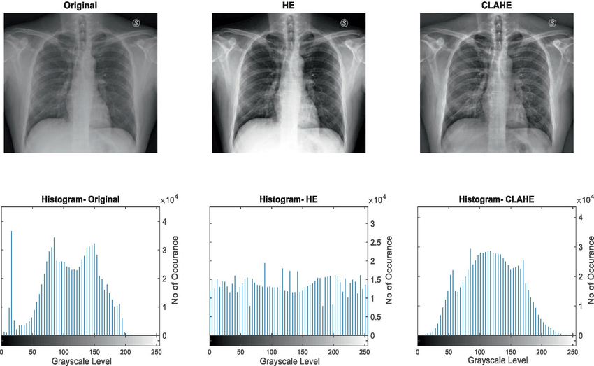
<figcaption>Fig. 16 - Comparison between original, HE, and CLAHE equalized X-ray
images with corresponding histograms</figcaption>
</figure>

As it may be seen, CLAHE provides a better histogram equalization than
in traditional HE method. As it was mentioned, converted images are in
*RGB* color space, but CLAHE, applied on this color map, impacts the
coloring of the images, since it modifies at least one of the three
color channels, that are highly-correlated, thus producing new artifact
colors [[23]](#ref_intro_23), which can make ML Models capture new unwanted data as
patterns. Besides that, in imaging, an important aspect is
device-dependency. *RGB* is device-dependent, meaning images in *RGB*
are interpreted differently depending on the device it is viewed. Thus,
a need of a consistent and device-independent color map has appeared.
This need was full-filled in 1976 when *CIELAB* color map was developed.
*CIELAB* is a color map that is formed of 3 components: $`L`$ -
Perceptual Lightness ($`L \in [0, 100]`$, where $`0 = Black`$ and
$`100 = White`$), $`a^*`$ - first color component
($`a^* \in [-127, 127]`$, where $`-127 = Green`$ and $`127 = Red`$) and
$`b^*`$ - second color component ($`a^* \in [-127, 127]`$, where
$`-127 = Yellow`$ and $`100 = 127`$), which can represent the gamut of
human color perception, thus making it the most appropriate for accurate
color interpretation in images, especially in restoring details CNN
output [[24]](#ref_intro_24). For example, *RGB* can represent a small portion of the
range of possible color nuances (See fig.
<a href="#fig:lit_rev_fig_17" data-reference-type="ref"
data-reference="fig:lit_rev_fig_17">17</a>).

<figure id="fig:lit_rev_fig_17">
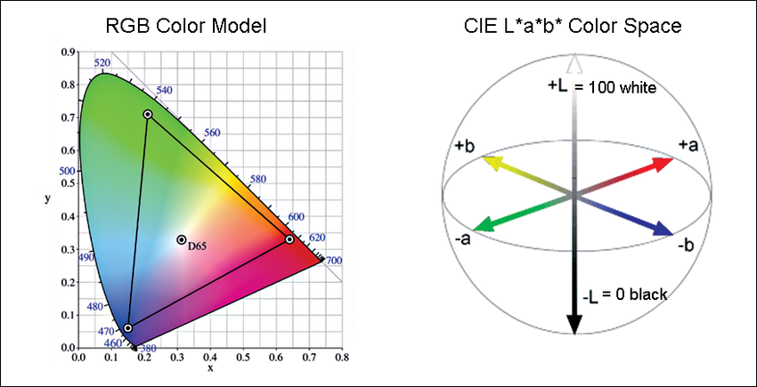
<figcaption>Fig. 17 - Comparison between <em>RGB</em> and <em>CIELAB</em> color
spaces</figcaption>
</figure>

As it may be seen, the triangle on the left side represents how *RGB*
captures color nuances, being a subset of the possible colors
represented in *CIELAB* color space. Since *CIELAB* contains a separate
channel for Lightness, it can be used for CLAHE algorithm, thus leaving
color channels untouched, that will not produce color artifacts, making
it appropriate for application in Medical Imaging.

Returning back to the discussed research paper on U-Net application in
Radiology Imaging, one important step in dataset preprocessing is
conversion from *RGB* color space to *CIELAB*.

``` python
# Using OpenCV, read radiologic images.
img_rgb = cv2.imread(os.path.join(dataset_directory, filename))
# By default, OpenCV library reads images in BGR color space, therefore, for the conversion to LAB, images should be in RGB color space.
img_rgb = cv2.cvtColor(img_rgb, cv2.COLOR_BGR2RGB)
# OpenCV supports LAB color space and offers functions to operate with LAB format.
img_lab = cv2.cvtColor(img_rgb, cv2.COLOR_RGB2LAB)
```

After conversion to *CIELAB* color space, CLAHE algorithm is safely
applied on the $`L`$ channel. Thus, the contrast of the images are
enhanced.

``` python
# Initialize CLAHE object using default arguments
clahe = cv2.createCLAHE(clipLimit=2.0, tileGridSize=(8, 8))
# Split the image by channels (L, a*, b*)
l, a, b = cv2.split(img_lab)
# Apply CLAHE Transformation on L channel
l_clahe = clahe.apply(l)
# Restore back the image by combining all 3 channels
img_lab_clahe = cv2.merge([l_clahe, a, b])
# Convert back to RGB for visualization (alternativelly, save in .tiff format, because supports float pixel values)
img_lab_rgb = cv2.cvtColor(img_lab, cv2.COLOR_LAB2RGB)
img_lab_clahe_rgb = cv2.cvtColor(img_lab_clahe, cv2.COLOR_LAB2RGB)
```

Next step of preprocessing in the paper is applying Gaussian Filter in
order to reduce the noise and smooth the image, increasing the overall
quality of the image.

``` python
# Apply Gaussian Filter with kernel size 5x5 and standard deviation on X-axis 0
img_lab_clahe_gauss = cv2.GaussianBlur(img_lab_clahe, (5, 5), 0)
# Convert LAB image to RGB for visualization
img_lab_clahe_gauss_rgb = cv2.cvtColor(img_lab_clahe_gauss, cv2.COLOR_LAB2RGB)
```

After that, all the resulting images are resized to $`256\times256`$ to
imply consistency in images and adhere to U-Net architecture input
dimensions, and normalized. All of the masks were also resized to the
same dimension, normalized and reshaped to include a single channel.

As an example of the preprocessing, below is provided, step-by-step,
modifications of the images alongside with ground-truth segmentation
from the training examples (See fig.
<a href="#fig:lit_rev_fig_18" data-reference-type="ref"
data-reference="fig:lit_rev_fig_18">18</a>).

<figure id="fig:lit_rev_fig_18">
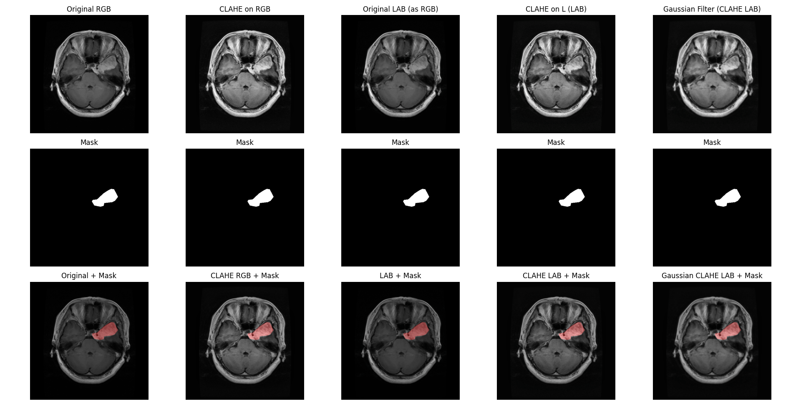
<figcaption>Fig. 18 - Original and Applied <em>LAB</em> conversion and CLAHE
algorithm - Original dimension</figcaption>
</figure>

The proposed model in the reviewed paper is Multi-Scale Attention U-Net
with EfficientNet-B4 Encoder. As it was mentioned, U-Net is formed of
two components - Encoder and Decoder.

1.  **Encoder**: EfficientNet-B4 encoder that is pretrained of ImageNet
    dataset, provides very high performance results, responsible for
    hierarchical feature extraction and captures low-level and
    high-level features useful for brain tumor segmentation. Besides
    classical convolution layer, it uses the concept of Mobile Inverted
    Bottleneck Convolution (MBConv) layers (See fig.
    <a href="#fig:lit_rev_fig_19" data-reference-type="ref"
    data-reference="fig:lit_rev_fig_19">19</a>).

    <figure id="fig:lit_rev_fig_19">
    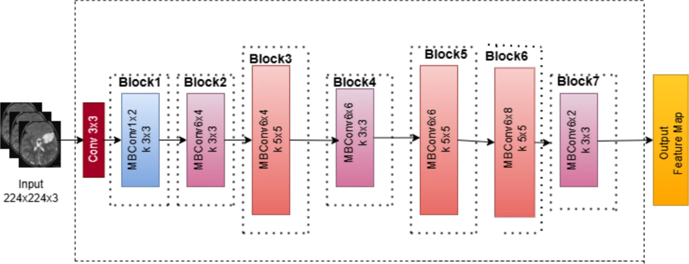
    <figcaption>Fig. 19 - EfficientNet-B4 Architecture</figcaption>
    </figure>

    First step is to pass input image through simple convolution layer,
    while the rest of the blocks are MBConv layers, that comprises
    multiple convolution operations. Initially, $`1\times1`$ convolution
    block expands the number of input channels, then depth-wise
    $`3\times3`$ convolution block is applied over produced channels.
    After that, the output is sent through a skip connection to the end
    of the layer and, at the same time, to the Squeeze-and-Excitation
    block, that reduces the map, applies non-linear activation function
    and restores the spatial dimensions, where first the map is squeezed
    and then expanded back to original shape. This allows model to
    perceive important feature better, since their "weights" are higher
    than for non-important features, and this type of layer can perceive
    them better (See fig.
    <a href="#fig:lit_rev_fig_20" data-reference-type="ref"
    data-reference="fig:lit_rev_fig_20">20</a>).

    <figure id="fig:lit_rev_fig_20">
    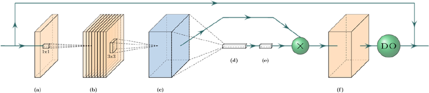
    <figcaption>Fig. 20 - MBConv Architecture</figcaption>
    </figure>

2.  **Decoder**: Multi-Scale Attention architecture is embedded inside
    of the Decoder and focuses on spatial position of important features
    in the encoder feature maps by applying additional residual
    attention blocks and combining them with features from the encoder
    using skip connections, improving model segmentation on relevant
    features. Each decoder block acts as a Residual Attention Block,
    which combines skip connections with multi-scale attention
    techniques. First, as in original U-Net, feature map is up-sampled
    using transposed convolution, increasing spatial dimensions of the
    maps. "Multi-Scale", in this context, uses convolutions with
    different kernel sizes, in order to obtain contextual information at
    different scales. After that, using simple convolution, all the
    generated maps are merged into a single one. An attention mask is
    produces by passing multiscale features through another convolution
    and activation layer, that is later applied through element-wise
    multiplication to the feature map (See fig.
    <a href="#fig:lit_rev_fig_21" data-reference-type="ref"
    data-reference="fig:lit_rev_fig_21">21</a>).

    <figure id="fig:lit_rev_fig_21">
    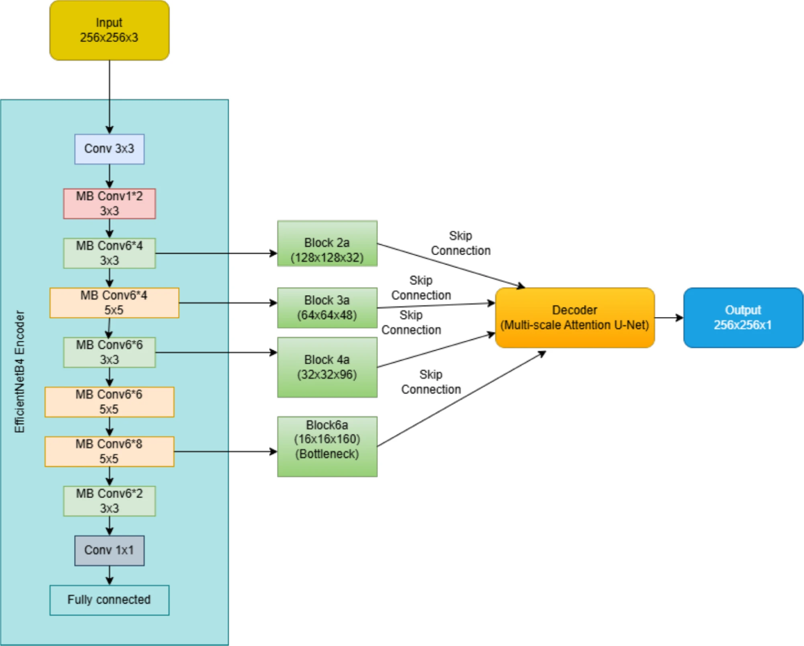
    <figcaption>Fig. 21 - Multi-Scale Attention Decoder</figcaption>
    </figure>

In the paper, researchers focused on several metrics:

1.  **Dice similarity coefficient (DSC)**: measures the overlap between
    Predicted Segmentation and Ground Truth Segmentation. Higher values
    of DSC coefficient indicate accurate tumor localization.
    ``` math
    \begin{gathered}
    DSC = \frac{2|P \cap G|}{|P|+|G|} \\
    P \text{ - Predicted Segmentation} \\
    G \text{ - Ground Truth Segmentation} \\
    |P| \text{ - total number of pixels in predicted segmentation} \\
    |G| \text{ - total number of pixels in ground truth segmentation} \\
    |P \cap G| \text{ - total number of overlapping pixels in between predicted and ground truth segmentation}
        
    \end{gathered}
    ```

2.  **Intersection over union (IoU)**: known as Jaccard Index, measures
    the ratio between the intersection and union between Predicted
    Segmentation and Ground Truth Segmentation. Compared to DSC, IoU
    penalizes more under- and over-segmentation. However, those two
    metrics are pretty similar and offer relatively similar values. One
    of the most used metrics is DSC, due to the fact that, using DSC,
    can be computed Dice Loss $`Dice_{Loss} = 1 - DSC`$, that is
    differentiable, while IoU is not.
    ``` math
    \begin{gathered}
    IoU = \frac{|P \cap G|}{|P \cup G|} = \frac{|P \cap G|}{|P| + |G| - |P \cap G|} \\
    P \text{ - Predicted Segmentation} \\
    G \text{ - Ground Truth Segmentation} \\
    |P| \text{ - total number of pixels in predicted segmentation} \\
    |G| \text{ - total number of pixels in ground truth segmentation} \\
    |P \cap G| \text{ - total number of overlapping pixels in between predicted and ground truth segmentation} \\
    |P \cup G| \text{ - total number of distinct pixels either in predicted or ground truth segmentation}
        
    \end{gathered}
    ```

3.  **Mean intersection over union (mean IoU)**: measures the average
    intersection between the predicted and ground-truth segmentation
    across all classes in order to give a general interpretation of
    models performance.
    ``` math
    \begin{gathered}
    IoU_{mean} = \frac{1}{C} \sum_{c=1}^C \frac{|P_c \cap G_c|}{|P_c \cup G_c|} = \frac{1}{C} \sum_{c=1}^C \frac{|P_c \cap G_c|}{|P_c| + |G_c| - |P_c \cap G_c|} \\
    C \text{ - total number of classes} \\
    P_c \text{ - Predicted Segmentation for class $c$} \\
    G_c \text{ - Ground Truth Segmentation for class $c$} \\
    |P_c| \text{ - total number of pixels in predicted segmentation for class $c$} \\
    |G_c| \text{ - total number of pixels in ground truth segmentation for class $c$} \\
    |P_c \cap G_c| \text{ - total number of overlapping pixels in between predicted and ground truth segmentation for class $c$} \\
    |P_c \cup G_c| \text{ - total number of distinct pixels either in predicted or ground truth segmentation for class $c$}
        
    \end{gathered}
    ```

4.  **Precision**: measures the ratio of correctly identified tumor
    pixels of the total number of pixels that were classified as tumors.
    ``` math
    \begin{gathered}
    Precision = \frac{TP}{TP + FP} \\
    TP \text{ - total number of correctly classified pixels as tumors} \\
    FP \text{ - total number of incorrectly classified non-tumor pixels as tumors}
        
    \end{gathered}
    ```

5.  **Recall**: measures the ratio of correctly classified tumor pixels
    and the total number of actual tumor pixels.
    ``` math
    \begin{gathered}
    Recall = \frac{TP}{TP + FN} \\
    TP \text{ - total number of correctly classified pixels as tumors} \\
    FN \text{ - total number of incorrectly classified tumor pixels as non-tumors}
        
    \end{gathered}
    ```

6.  **Specificity**: measures the ratio between correctly identified
    non-tumor pixels and the total number of actual non-tumor pixels.
    ``` math
    \begin{gathered}
    Sensitivity = \frac{TN}{TN + FP} \\
    TN \text{ - total number of correctly classified pixels as non-tumors} \\
    FP \text{ - total number of incorrectly classified non-tumor pixels as tumors}
        
    \end{gathered}
    ```

7.  **Accuracy**: measures the ratio of correctly predicted pixels to
    the total number of pixels. This metric, taken alone, may be
    misleading, because it does not take into consideration cases of
    imbalanced datasets (ratio of one class to another class is very
    high, e.g. Brain Tumor Classification Problems). For example, if a
    model was trained on an imbalanced dataset, it might learn to
    predict the majority class to all samples, and since there is a very
    high number of samples of majority class, this metric will show high
    accuracy, but the model is still performing badly, since it
    misclassifies all of the minority class.
    ``` math
    \begin{gathered}
    Accuracy = \frac{TP + TN}{TP + TN + FP + FN} \\
    TP \text{ - total number of correctly classified pixels as tumors} \\
    TN \text{ - total number of correctly classified pixels as non-tumors} \\
    FP \text{ - total number of incorrectly classified non-tumor pixels as tumors} \\
    FN \text{ - total number of incorrectly classified tumor pixels as non-tumors}
        
    \end{gathered}
    ```

As a result, their proposed enhanced U-Net performed very well.
Specifically, they performed a comparative analysis between different
types of EfficientNet-B family of Encoders. With EfficientNet-B4
Encoder, their model obtained highest DSC, IoU and Recall, that resulted
in the best segmentation of tumor pixels. Besides that, since medicine
is a field where mistakes may have heavy consequences, it is a practice
to sacrifice Precision in order to obtain higher Recall, which means
that it is better to misclassify some radiologic images that exhibit
non-tumor patients rather than to misclassify some patients that
actually have a tumor or multiple ones as being non-tumor patients.
Besides that, EfficientNet-B4 Encoder manifested lower consumption of
computational power compared to EfficientNet-B6, that had similar
results in performance metrics.

<div id="tab:tab_1">

| **Model**         | **DSC** | **IoU** | **Precision** | **Recall** | **Specificity** |
|:------------------|:--------|:--------|:--------------|:-----------|:----------------|
| *EfficientNet-B0* | 0.9127  | 0.8476  | 0.9756        | 0.8683     | 0.9998          |
| *EfficientNet-B1* | 0.9026  | 0.8419  | 0.9738        | 0.8645     | 0.9997          |
| *EfficientNet-B2* | 0.9289  | 0.8725  | 0.9705        | 0.8983     | 0.9997          |
| *EfficientNet-B3* | 0.8986  | 0.8222  | 0.9864        | 0.8327     | 0.9999          |
| *EfficientNet-B4* | 0.9339  | 0.8795  | 0.9657        | 0.9103     | 0.9996          |
| *EfficientNet-B5* | 0.8806  | 0.8212  | 0.9647        | 0.8498     | 0.9996          |
| *EfficientNet-B6* | 0.9327  | 0.8778  | 0.9671        | 0.9063     | 0.9997          |
| *EfficientNet-B7* | 0.9171  | 0.8120  | 0.9817        | 0.8664     | 0.9998          |

Comparison of EfficientNet-B Encoder Family variants performance

</div>

As a result of testing the model with those encoder, they obtained the
following plot (See fig.
<a href="#fig:lit_rev_fig_22" data-reference-type="ref"
data-reference="fig:lit_rev_fig_22">22</a>). It may be noticed that
EfficientNet-B4 obtained the closest segmentation to the original
ground-truth one.

<figure id="fig:lit_rev_fig_22">
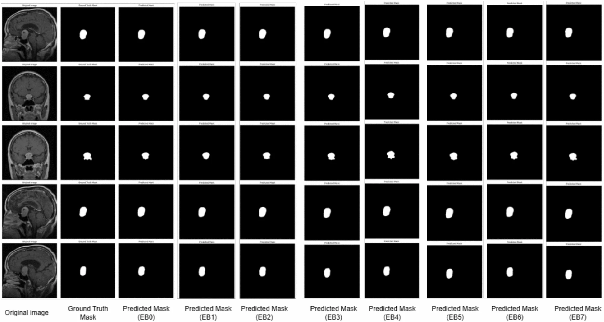
<figcaption>Fig. 22 - Predicted Binary Masks by Multi-Scale Attention U-Net with
each Encoder of EfficientNet-B Family alongside with Ground-Truth Mask
and original Image.</figcaption>
</figure>

Another study focused on implementation of Optimized Fuzzy K-Means
clustering algorithm for Brain Tumor Segmentation. K-Means clustering is
an iterative, centroid-based clustering Unsupervised Machine Learning
algorithm that segments a dataset into similar groups based on the
distance between their centroids [[25]](#ref_intro_25). In classical K-Means
Clustering, the steps to train the model are the following:

1.  Initialization of the number of Clusters $`K`$. This should be done
    before-hand.

2.  Random selection of $`K`$ points from the dataset and are assigned
    different labels.

3.  Each point in the dataset is assigned to the closest cluster $`K_i`$
    by Euclidian Distance.
    ``` math
    \begin{gathered}
    Distance = \sqrt{\left(x_2-x_1\right)^2 + \left(y_2-y_1\right)^2} \\
    \left(x_1, y_1\right) \text{ - coordinates of $K_i$ centroid} \\
    \left(x_2, y_2\right) \text{ - coordinates of analyzed data point}
        
    \end{gathered}
    ```

4.  After all the points are assigned, recalculate the centroids as mean
    of all point assigned to the cluster $`K_i`$.
    ``` math
    \begin{gathered}
    K_i = \frac{1}{n_i}\sum_{j=1}^{n_i} \vec{x_i} \\
    n_i \text{ - number of points in cluster $i$} \\
    K_i \text{ - new centroid of cluster $i$} \\
    \vec{x_i} \text{ - vector representing each data point in the cluster $i$}
        
    \end{gathered}
    ```

5.  Repeat iteratively previous two steps until no change in clusters
    centroids or maximum iterations achieved (See fig. <a href="#fig:lit_rev_fig_23" data-reference-type="ref" data-reference="fig:lit_rev_fig_23">23</a>).

<figure id="fig:lit_rev_fig_23">
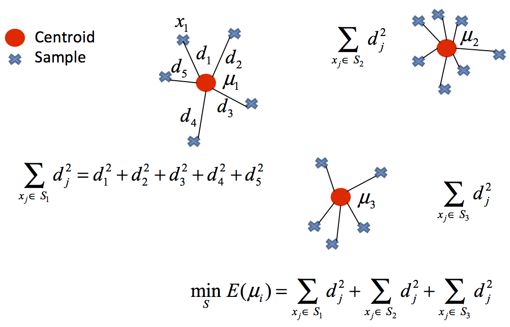
<figcaption>Fig. 23 - Example of K-Means Algorithm</figcaption>
</figure>

Fuzzy K-Means works using Fuzzy Logic. It computes a Membership Matrix
for each data point in contrast to Euclidean Distance applied in the
original K-Means. This approach allows overlapping clusters and adds
flexibility, since it offers soft-decision results in format of
probabilities of data points cluster membership.

In the above-mentioned study, authors used Fuzzy K-Means Clustering for
Brain Tumor Segmentation. As a preprocessing step of the radiologic
images, they implemented Gaussian Blur and Normalization, similar to the
approach from previous study case. However, no additional Contrast
Enhancement techniques were applied.

As for the model, they similarly used additional implementations, such
as:

1.  **Centroid Initialization with K-Means++**: one centroid is selected
    at random and subsequent selection is done based on the probability
    that is proportional to the square of the Euclidean Distance between
    the data point and closest selected center.

2.  **Use of Vectorization**: in membership update step, they used
    vectorized operations of matrices, and others.

As evaluation metrics, they used DSC, IoU, Precision, Recall, Accuracy
and F1-Score.

As a result, they obtained the following predictions (See fig.
<a href="#fig:lit_rev_fig_24" data-reference-type="ref"
data-reference="fig:lit_rev_fig_24">24</a>). As it may be seen, Fuzzy
K-Means performed close to the ground-truth binary masks segmentation.
Its predictions overall visual similarities with true label masks can be
seen, however False Positives and False Negatives can still be seen,
but, since the approach is much less complex than CNNs, results are
impressive.

<figure id="fig:lit_rev_fig_24">
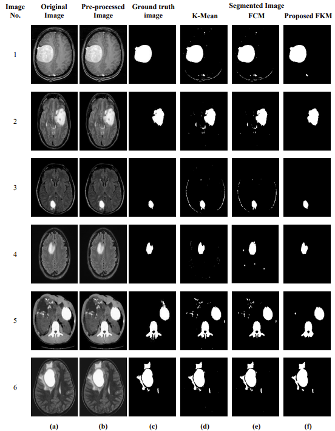
<figcaption>Fig. 24 - Segmentation Results <strong>(a)</strong> Original Image
<strong>(b)</strong> Preprocessed Image, <strong>(c)</strong>
Ground-Truth Binary Mask <strong>(d)</strong> K-Means Clustering,
<strong>(e)</strong> FCM <strong>f</strong> Proposed Fuzzy K-Means
Clustering</figcaption>
</figure>

At the end of the paper, they offered the performance metrics of the
Fuzzy K-Means Clustering in Brain Tumor Image Segmentation. The
performance is very high, higher than in the previous study case with
U-Net as a model. This also may be due to the differences in the dataset
sizes, as well as other factors that may affect the metric performances.
Besides this, not much information was provided on the algorithms and
implementations in both articles, therefore no comparison between them
may be done.

<div id="tab:tab_2">

| **Image No.** | **DSC** | **IoU** | **Precision** | **Recall** | **Accuracy** | **F1 Score** |
|:---|:---|:---|:---|:---|:---|:---|
| *1* | 0.9776 | 0.9562 | 0.9899 | 0.9656 | 0.9960 | 0.9776 |
| *2* | 0.9724 | 0.9464 | 0.9781 | 0.9669 | 0.9972 | 0.9724 |
| *3* | 0.9721 | 0.9457 | 0.9699 | 0.9743 | 0.9994 | 0.9721 |
| *4* | 0.9707 | 0.9430 | 0.9617 | 0.9797 | 0.9988 | 0.9707 |
| *5* | 0.9145 | 0.8825 | 0.9928 | 0.8477 | 0.9862 | 0.9145 |
| *6* | 0.9861 | 0.9778 | 0.9852 | 0.9101 | 0.9912 | 0.9461 |
| *Average* | 0.9072 | 0.9419 | 0.9796 | 0.9407 | 0.9948 | 0.9589 |

Analysis of Fuzzy K-Means Clustering Performance Metrics in Brain Tumor
Segmentation Task

</div>

# CONCLUSIONS

High performance in Image Segmentation, for example Brain Tumor
Segmentation, manifested by various Machine Learning Models, especially
U-Net and Fuzzy K-Means Clustering, specifically tailored for
Applications in Medical Imaging, is a result of complex work of many
people. As demonstrated, those models may represent a valuable
assistance for radiologists in their routine work by reducing the amount
of time spent per each image and assisting in image exploration and,
possibly, reduce the rate of error in their practice.

# Bibliography
<div id="refs" class="references csl-bib-body" entry-spacing="0">

<div id="ref-intro_1" class="csl-entry">

<span class="csl-left-margin">\[1\]
</span><span class="csl-right-inline">M. Tubiana, “Wilhelm conrad
röntgen and the discovery of x-rays,” *Bull Acad Natl Med*, vol. 180,
no. 1, pp. 97–108, Jan. 1996.</span>

</div>

<div id="ref-intro_2" class="csl-entry">

<span class="csl-left-margin">\[2\]
</span><span class="csl-right-inline">M. F. Vardeu, O. Larentis, I.
Vecchio, I. Gorini, M. Martini, N. Bragazzi, A. D’Ambra, M. Ruggieri,
and C. Tornali, “History of use and abuse of x-ray: The early 20th
century italian pediatrics school,” *Acta Biomed*, vol. 91, no. 1, pp.
113–117, Mar. 2020.</span>

</div>

<div id="ref-intro_3" class="csl-entry">

<span class="csl-left-margin">\[3\]
</span><span class="csl-right-inline">M. Winder, A. J. Owczarek, J.
Chudek, J. Pilch-Kowalczyk, and J. Baron, “[Are we overdoing it? Changes
in diagnostic imaging workload during the years 2010–2020 including the
impact of the SARS-CoV-2
pandemic](https://doi.org/10.3390/healthcare9111557),” *Healthcare*,
vol. 9, no. 11, 2021.</span>

</div>

<div id="ref-intro_4" class="csl-entry">

<span class="csl-left-margin">\[4\]
</span><span class="csl-right-inline">Ö. Kasalak, H. Alnahwi, R.
Toxopeus, J. P. Pennings, D. Yakar, and T. C. Kwee, “Work overload and
diagnostic errors in radiology,” *Eur J Radiol*, vol. 167, p. 111032,
Aug. 2023.</span>

</div>

<div id="ref-intro_5" class="csl-entry">

<span class="csl-left-margin">\[5\]
</span><span class="csl-right-inline">R. Najjar, “Redefining radiology:
A review of artificial intelligence integration in medical imaging,”
*Diagnostics (Basel)*, vol. 13, no. 17, Aug. 2023.</span>

</div>

<div id="ref_intro_6" class="csl-entry">

<span class="csl-left-margin">\[6\]
</span><span class="csl-right-inline">A. Alnuaimi and T. Albaldawi, “[An
overview of machine learning classification
techniques](https://doi.org/10.1051/bioconf/20249700133),” *BIO Web of
Conferences*, vol. 97, p. 00133, Apr. 2024.</span>

</div>

<div id="ref_intro_7" class="csl-entry">

<span class="csl-left-margin">\[7\]
</span><span class="csl-right-inline">S. Naeem, A. Ali, S. Anam, and M.
Ahmed, “[An unsupervised machine learning algorithms: Comprehensive
review](https://doi.org/10.12785/ijcds/130172),” *IJCDS Journal*, vol.
13, pp. 911–921, Apr. 2023.</span>

</div>

<div id="ref_intro_8" class="csl-entry">

<span class="csl-left-margin">\[8\]
</span><span class="csl-right-inline">Z. Hao, “[Deep learning review and
discussion of its future
development](https://doi.org/10.1051/matecconf/201927702035),” *MATEC
Web of Conferences*, vol. 277, p. 02035, Jan. 2019.</span>

</div>

<div id="ref_intro_9" class="csl-entry">

<span class="csl-left-margin">\[9\]
</span><span class="csl-right-inline">V. Gupta, “[Understanding
feedforward neural
networks](https://learnopencv.com/understanding-feedforward-neural-networks/),”
*LearnOpenCV*. Feb-2024.</span>

</div>

<div id="ref_intro_10" class="csl-entry">

<span class="csl-left-margin">\[10\]
</span><span class="csl-right-inline">AFIT Data Science Lab, “Artificial
neural network fundamentals · AFIT data science lab r programming
guide.” <https://afit-r.github.io/ann_fundamentals>, 2025.</span>

</div>

<div id="ref_intro_11" class="csl-entry">

<span class="csl-left-margin">\[11\]
</span><span class="csl-right-inline">S. Shelke, I. Pathak, A. Sangai,
D. Lunge, K. Shahale, and H. Vyawahare, “[A review paper on computer
vision](https://doi.org/10.48175/IJARSCT-8901),” *International Journal
of Advanced Research in Science, Communication and Technology*, pp.
673–677, Mar. 2023.</span>

</div>

<div id="ref_intro_12" class="csl-entry">

<span class="csl-left-margin">\[12\]
</span><span class="csl-right-inline">P. M. Cheng, E. Montagnon, R.
Yamashita, I. Pan, A. Cadrin-Chênevert, F. Perdigón Romero, G.
Chartrand, S. Kadoury, and A. Tang, “[Deep learning: An update for
radiologists](https://doi.org/10.1148/rg.2021200210),” *RadioGraphics*,
vol. 41, no. 5, pp. 1427–1445, 2021.</span>

</div>

<div id="ref_intro_13" class="csl-entry">

<span class="csl-left-margin">\[13\]
</span><span class="csl-right-inline">Z. Mustafa and H. Nsour, “[Using
computer vision techniques to automatically detect abnormalities in
chest x-rays](https://doi.org/10.3390/diagnostics13182979),”
*Diagnostics*, vol. 13, no. 18, 2023.</span>

</div>

<div id="ref_intro_14" class="csl-entry">

<span class="csl-left-margin">\[14\]
</span><span class="csl-right-inline">I. Purwono, A. Ma’arif, W.
Rahmaniar, H. Imam, H. I. K. Fathurrahman, A. Frisky, and Q. M. U. Haq,
“[Understanding of convolutional neural network (CNN): A
review](https://doi.org/10.31763/ijrcs.v2i4.888),” *International
Journal of Robotics and Control Systems*, vol. 2, pp. 739–748, Jan.
2023.</span>

</div>

<div id="ref_intro_15" class="csl-entry">

<span class="csl-left-margin">\[15\]
</span><span class="csl-right-inline">M. M and S. P, “[COVID-19
infection prediction from CT scan images of lungs using iterative
convolution neural network
model](https://doi.org/10.1016/j.advengsoft.2022.103214),” *Advances in
Engineering Software*, vol. 173, p. 103214, 2022.</span>

</div>

<div id="ref_intro_16" class="csl-entry">

<span class="csl-left-margin">\[16\]
</span><span class="csl-right-inline">J. Long, E. Shelhamer, and T.
Darrell, “[Fully convolutional networks for semantic
segmentation](http://arxiv.org/abs/1411.4038),” *CoRR*, vol.
abs/1411.4038, 2014.</span>

</div>

<div id="ref_intro_17" class="csl-entry">

<span class="csl-left-margin">\[17\]
</span><span class="csl-right-inline">M. A. Al Mamun and I. Kadir,
“[An-eye: SAFE NAVIGATION IN FOOTPATH FOR VISUALLY IMPAIRED USING
COMPUTER VISION
TECHNIQUES](https://doi.org/10.13140/RG.2.2.19394.66242),” PhD thesis,
2020.</span>

</div>

<div id="ref_intro_18" class="csl-entry">

<span class="csl-left-margin">\[18\]
</span><span class="csl-right-inline">X.-X. Yin, L. Sun, Y. Fu, R. Lu,
and Y. Zhang, “U-Net-Based medical image segmentation,” *J Healthc Eng*,
vol. 2022, p. 4189781, Apr. 2022.</span>

</div>

<div id="ref_intro_19" class="csl-entry">

<span class="csl-left-margin">\[19\]
</span><span class="csl-right-inline">O. Ronneberger, P. Fischer, and T.
Brox, “[U-net: Convolutional networks for biomedical image
segmentation](http://arxiv.org/abs/1505.04597),” *CoRR*, vol.
abs/1505.04597, 2015.</span>

</div>

<div id="ref_intro_20" class="csl-entry">

<span class="csl-left-margin">\[20\]
</span><span class="csl-right-inline">K. Boutis, S. Cano, M. Pecaric, T.
Welch-Horan, B. Lampl, C. Ruzal-Shapiro, and M. Pusic, “[Interpretation
difficulty of normal versus abnormal radiographs using a pediatric
example](https://doi.org/10.36834/cmej.36654),” *Canadian medical
education journal*, vol. 7, pp. e68–77, Mar. 2016.</span>

</div>

<div id="ref_intro_21" class="csl-entry">

<span class="csl-left-margin">\[21\]
</span><span class="csl-right-inline">J. Walsh, A. Othmani, M. Jain, and
S. Dev, “[Using u-net network for efficient brain tumor segmentation in
MRI images](https://doi.org/10.1016/j.health.2022.100098),” *Healthcare
Analytics*, vol. 2, p. 100098, 2022.</span>

</div>

<div id="ref_intro_22" class="csl-entry">

<span class="csl-left-margin">\[22\]
</span><span class="csl-right-inline">GeeksforGeeks, “CLAHE histogram
equalization OpenCV.”
<https://www.geeksforgeeks.org/python/clahe-histogram-eqalization-opencv/>,
May-2020.</span>

</div>

<div id="ref_intro_23" class="csl-entry">

<span class="csl-left-margin">\[23\]
</span><span class="csl-right-inline">W. Yussof, “Performing contrast
limited adaptive histogram equalization technique on combined color
models for underwater image enhancement,” Jan. 2013.</span>

</div>

<div id="ref_intro_24" class="csl-entry">

<span class="csl-left-margin">\[24\]
</span><span class="csl-right-inline">D. Chen and H. Zhao, “[CCD-net:
Color-correction network based on dual-branch fusion of different color
spaces for image dehazing](https://doi.org/10.3390/app15063191),”
*Applied Sciences*, vol. 15, p. 3191, Mar. 2025.</span>

</div>

<div id="ref_intro_25" class="csl-entry">

<span class="csl-left-margin">\[25\]
</span><span class="csl-right-inline">E. Kavlakoglu and V. Winland,
“What is k-means clustering?”
<https://www.ibm.com/think/topics/k-means-clustering>,
26-Jun-2024.</span>

</div>

</div>
